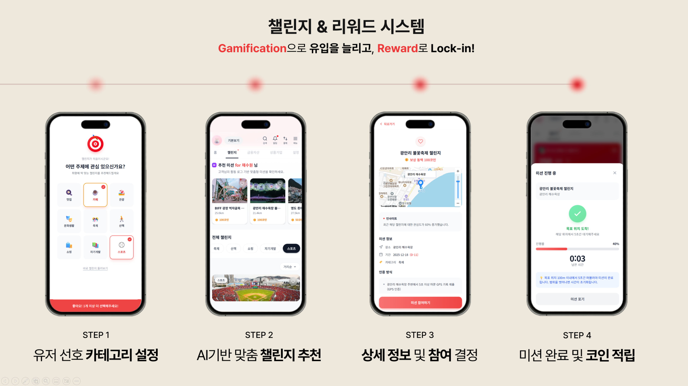

# BNK_WEB

[](https://nextjs.org/)
[](https://react.dev/)
[](https://www.typescriptlang.org/)
[](https://tailwindcss.com/)
[](https://vercel.com/)

> BNK 챌린지 서비스의 프론트엔드입니다.  
> Next.js App Router 기반의 모바일 우선 UI로, 미션 추천, 카테고리 필터링, 미션 상세, 참여/완료 흐름, 출석 UI, 관리자 알림 테스트 화면을 제공합니다.

---

## 🎬 Demo

[](https://youtu.be/e7bv3mprB2A)

---

## 🖼️ UI flow



위 화면 흐름은 현재 프런트 구현의 핵심 사용자 여정을 요약합니다.

1. 선호 카테고리 선택
2. AI 기반 추천 미션 조회
3. 상세 정보 확인 및 참여 결정
4. 미션 완료 후 코인 적립

---

## 📌 Overview

- **Framework**: Next.js 16 + React 19
- **Language**: TypeScript
- **Styling**: Tailwind CSS v4
- **Maps**: Kakao Maps JavaScript SDK
- **Integration target**: `BNK_API`
- **Deployment**: Vercel

이 프런트는 모바일 앱 웹뷰 화면을 염두에 두고 설계된 챌린지 UI로, 추천 미션 탐색부터 참여와 완료 흐름까지 한 화면 경험으로 제공합니다.

---

## ✨ Main features

- 홈 화면과 챌린지 화면 탭 전환
- 사용자 선호 카테고리 온보딩
- AI 추천 미션 카드
- 전체 미션 목록과 정렬
- 미션 상세 화면 및 지도 표시
- 미션 참여 후 위치 추적 오버레이
- 진행 중 미션 목록
- 출석 캘린더 UI
- 관리자용 푸시 발송 테스트 페이지

---

## 📁 Project structure

```text
src/
├── app/
│   ├── layout.tsx
│   ├── page.tsx
│   └── admin/
│       └── page.tsx
├── components/
├── hooks/
├── services/
├── data/
└── types/
```

---

## 🧩 Key screens and components

### App shell

- `src/app/layout.tsx`
  - Noto Sans KR 폰트 적용
  - 모바일 폭 중심 레이아웃
  - Kakao Maps SDK 스크립트 주입

- `src/app/page.tsx`
  - 메인 앱 엔트리포인트
  - 사용자, 탭, 카테고리, 추천 미션, 진행 중 미션, 출석 상태를 통합 관리

- `src/app/admin/page.tsx`
  - 푸시 알림 테스트용 관리자 화면

### Components

- `Header`
- `TabNavigation`
- `HomeScreen`
- `CoinCard`
- `AIRecommendSection`
- `CategoryFilter`
- `MissionList`
- `MissionCard`
- `MissionDetail`
- `InProgressSection`
- `AttendanceCalendar`
- `MissionTrackingOverlay`
- `OnboardingPreference`
- `KakaoMap`

### Hooks

- `useOnboarding`
- `useLocation`
- `useMissionTracking`

### Service layer

- `src/services/missionService.ts`
  - `BNK_API` 호출
  - 사용자, 추천 미션, 전체 미션, 참여/완료 흐름 연동

---

## 🔗 Integration with BNK_API

기본 API 주소:

```bash
NEXT_PUBLIC_API_URL=https://bnk-api.up.railway.app/v1
```

연동 범위:

- 사용자 정보 조회
- 탭 정보 조회
- AI 추천 미션 조회
- 전체 미션 목록 조회
- 진행 중 미션 조회
- 미션 좋아요 / 참여 / 완료
- 알림 관리자 페이지 연동

---

## ⚙️ Environment variables

```bash
NEXT_PUBLIC_API_URL=https://bnk-api.up.railway.app/v1
NEXT_PUBLIC_KAKAO_MAP_API_KEY=your_kakao_javascript_key
```

---

## 🚀 Run locally

```bash
npm install
npm run dev
```

open:

```text
http://localhost:3000
```

---

## 🔄 User flow

### 1. Initial load

- 사용자 정보 조회
- 탭 정보 조회
- 위치 권한 요청

### 2. Challenge tab

- 카테고리 선택
- 추천 미션, 전체 미션, 진행 중 미션, 출석 정보 로드

### 3. Mission participation

- 상세 화면에서 참여
- 위치 추적 시작
- 미션 완료 후 코인 잔액 갱신

---

## 🗺️ Kakao Map and WebView behavior

이 프런트는 브라우저 단독 실행과 React Native WebView 환경을 함께 고려합니다.

- browser
  - `navigator.geolocation`
  - 웹용 미션 추적 시뮬레이션
- React Native WebView
  - `requestNativeLocation`
  - `startMissionTracking`
  - `stopMissionTracking`
  - 커스텀 DOM 이벤트 수신

---

## 🧰 Static assets

- `public/db.png`: 코인 카드용 이미지
- `public/icon.png`, `favicon.*`, `apple-touch-icon.png`: 앱 아이콘
- `public/*.svg`: 보조 아이콘

---

## 🛠️ Tech stack

| Layer | Stack |
| --- | --- |
| Framework | Next.js 16, React 19 |
| Language | TypeScript |
| Styling | Tailwind CSS v4 |
| Maps | Kakao Maps JavaScript SDK |
| Data fetching | native `fetch` |
| Runtime assumptions | browser + React Native WebView |

---

## 🚢 Deployment

- Frontend: https://bnk-web.vercel.app/
- Backend API: https://bnk-api.up.railway.app

---

## 🔗 Related projects

- Backend API: [`BNK_API`](https://github.com/BNKCHALLENGE/BNK_API)
- ML recommendation service: [`ML_API`](https://github.com/BNKCHALLENGE/ML_API)
